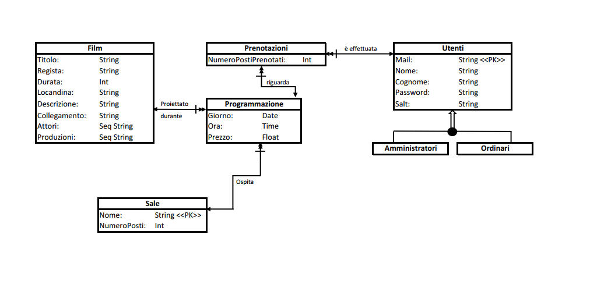
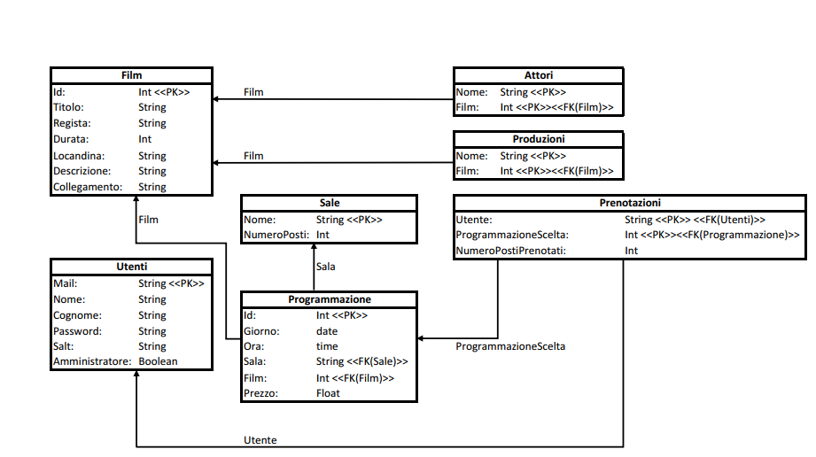
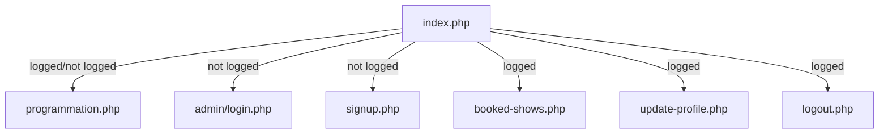
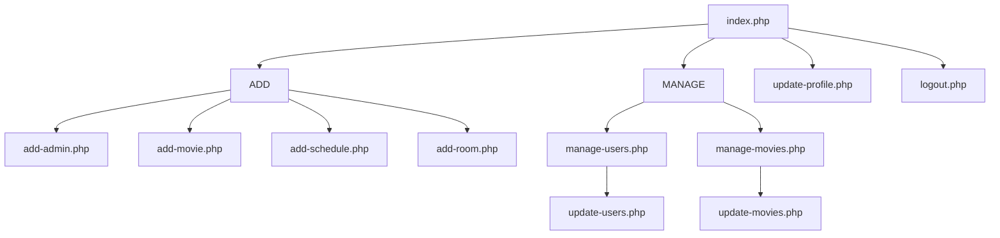

# RELAZIONE PROGETTO BASI DI DATI

[TOC]


<div style="page-break-after: always;"></div>

### Componenti del gruppo di lavoro

* Favero Andrea - `matricola`: 864893
* Medana Carlotta - `matricola`: 863421
* Sello Stefano -` matricola`: 864851

### Breve descrizione del progetto

Il progetto mira a sviluppare un sistema di gestione di prenotazioni per un cinema multisala.

Gli utilizzatori del sistema possono essere di due tipi: **amministratori** o **utenti ordinari**.

Gli **amministratori**, accedendo alla sezione `admin/` , avranno la possibilità di:

* Aggiungere un film all'elenco dei film proiettabili
* Modificare le informazioni riguardanti tale film
* Aggiungere un utente amministratore
* Modificare le informazioni riguardanti un utente ordinario
* Eliminare un account appartenente ad un utente ordinario
* Aggiungere sale
* Aggiornare la programmazione con luogo, ora, film e prezzo del biglietto delle varie proiezioni

Gli **utenti ordinari**, accedendo alla sezione principale del sito, avranno la possibilità di:

*  Visionare la programmazione, con film, giorno e ora della proiezione e prezzo del biglietto
* Effettuare la registrazione di un account
* Effettuare il login tramite le credenziali del proprio account
* Prenotare tot posti per una data proiezione (solo se loggati)
* Eliminare le proprie prenotazioni (solo se loggati)
* Effettuare il logout (solo se loggati)


<div style="page-break-after: always;"></div>

***

### Schema ad Oggetti



***

### Schema Relazionale



<div style="page-break-after: always;"></div>

### Codice SQL di creazione del Database

```sql
/*--- CREAZIONE TABELLE --- */

CREATE TABLE `attori` (
  `Nome` varchar(123),
  `Film` int(11) NOT NULL
);

CREATE TABLE `film` (
  `Id` int(11) NOT NULL,
  `Titolo` varchar(255),
  `Regista` varchar(255),
  `Durata` int(11),
  `Locandina` varchar(2047),
  `Descrizione` mediumtext,
  `Collegamento` varchar(2047)
);

CREATE TABLE `prenotazioni` (
  `Utente` varchar(123) NOT NULL,
  `ProgrammazioneScelta` int(11) NOT NULL,
  `NumeroPostiPrenotati` int(11) NOT NULL
);

CREATE TABLE `produzioni` (
  `Nome` varchar(123) NOT NULL,
  `Film` int(11) NOT NULL
);

CREATE TABLE `programmazione` (
  `Id` int(11) NOT NULL,
  `Giorno` date NOT NULL,
  `Ora` time NOT NULL,
  `Sala` varchar(123) NOT NULL,
  `Film` int(11) NOT NULL,
  `Prezzo` float NOT NULL
);

CREATE TABLE `sale` (
  `Nome` varchar(123) NOT NULL,
  `NumeroPosti` int(11) NOT NULL
);

CREATE TABLE `utenti` (
  `Mail` varchar(124) NOT NULL,
  `Nome` varchar(255) NOT NULL,
  `Cognome` varchar(255) NOT NULL,
  `Password` varchar(255) NOT NULL,
  `Salt` varchar(5) NOT NULL,
  `Amministratore` tinyint(1) NOT NULL
);

/*--- AGGIUNTA CHIAVI ALLE TABELLE --- */

ALTER TABLE `attori`
  ADD PRIMARY KEY (`Nome`,`Film`),
  ADD KEY `Film` (`Film`);

ALTER TABLE `film`
  ADD PRIMARY KEY (`Id`);

ALTER TABLE `prenotazioni`
  ADD PRIMARY KEY (`Utente`,`ProgrammazioneScelta`),
  ADD KEY `ProgrammazioneScelta` (`ProgrammazioneScelta`),
  ADD KEY `Utente` (`Utente`);

ALTER TABLE `produzioni`
  ADD PRIMARY KEY (`Nome`,`Film`),
  ADD KEY `ProduzioneFilm` (`Film`);

ALTER TABLE `programmazione`
  ADD PRIMARY KEY (`Id`),
  ADD KEY `Sala` (`Sala`),
  ADD KEY `Film` (`Film`);

ALTER TABLE `sale`
  ADD PRIMARY KEY (`Nome`);

ALTER TABLE `utenti`
  ADD PRIMARY KEY (`Mail`);
  
/*--- AGGIUNTA VINCOLI ALLE CHIAVI DELLE TABELLE --- */

ALTER TABLE `film`
  MODIFY `Id` int(11) NOT NULL AUTO_INCREMENT;

ALTER TABLE `programmazione`
  MODIFY `Id` int(11) NOT NULL AUTO_INCREMENT;

ALTER TABLE `attori`
  ADD CONSTRAINT `AttoriPrincipali` FOREIGN KEY (`Film`) REFERENCES `film` (`Id`);

ALTER TABLE `prenotazioni`
  ADD CONSTRAINT `PrenotazioneProgrammazione` FOREIGN KEY (`ProgrammazioneScelta`) 		REFERENCES `programmazione` (`Id`),
  ADD CONSTRAINT `PrenotazioneUtente` FOREIGN KEY (`Utente`) REFERENCES `utenti` 		(`Mail`);

ALTER TABLE `produzioni`
  ADD CONSTRAINT `ProduzioneFilm` FOREIGN KEY (`Film`) REFERENCES `film` (`Id`);

ALTER TABLE `programmazione`
  ADD CONSTRAINT `FilmProgrammazione` FOREIGN KEY (`Film`) REFERENCES `film` (`Id`),
  ADD CONSTRAINT `SalaProgrammazione` FOREIGN KEY (`Sala`) REFERENCES `sale` (`Nome`);
```

<div style="page-break-after: always;"></div>

### Struttura applicazione Web

#### Utente ordinario 

---




<div style="page-break-after: always;"></div>

#### Amministratore

---

 L'area amministratore è accessibile tramite la sezione `admin/` del sito web. Visitare tale pagina richiede necessariamente di loggarsi con un account amministratore. Nel diagramma di flusso sottostante è sottointeso che ogni pagina si trova nella cartella `admin/`.

